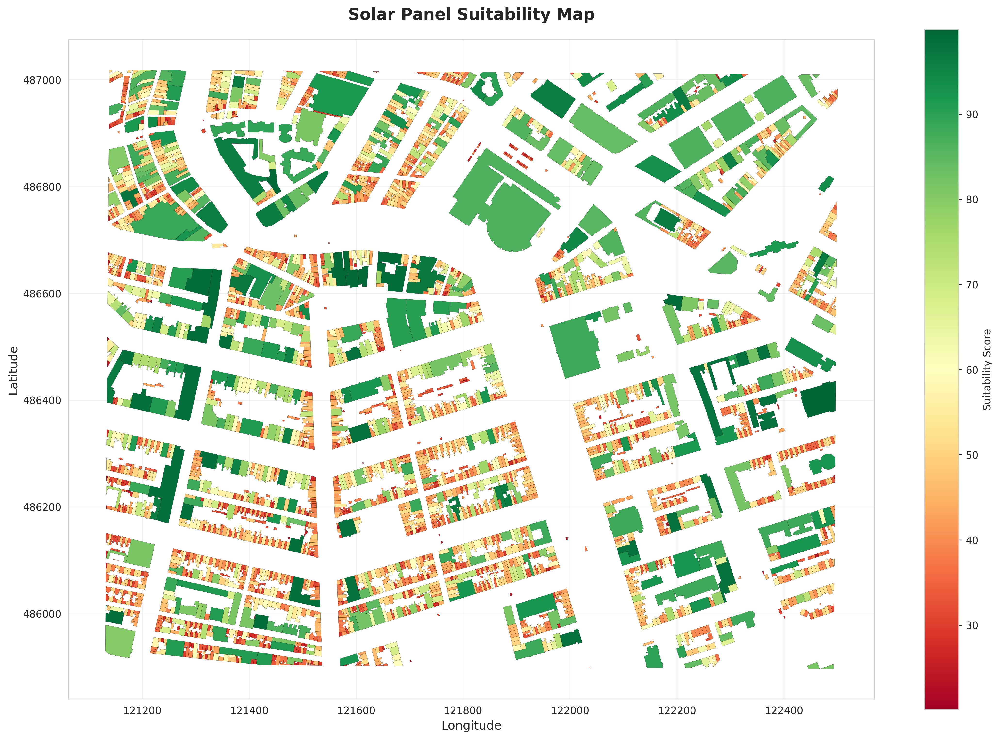
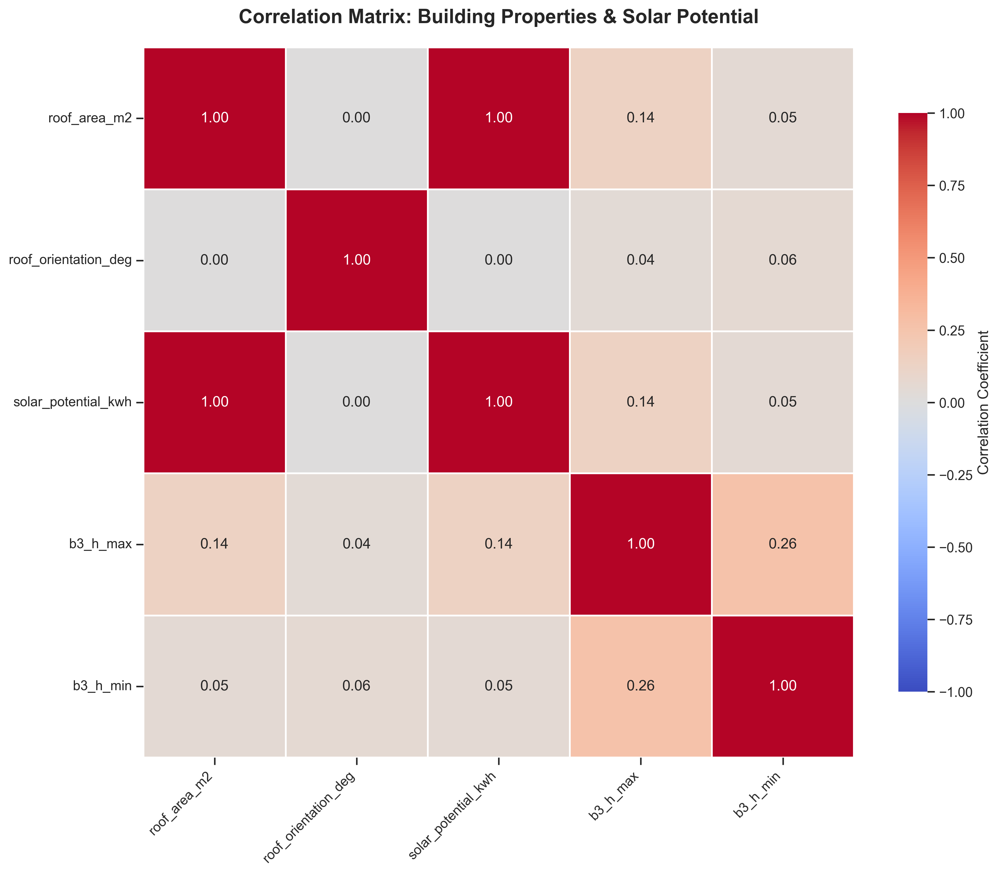
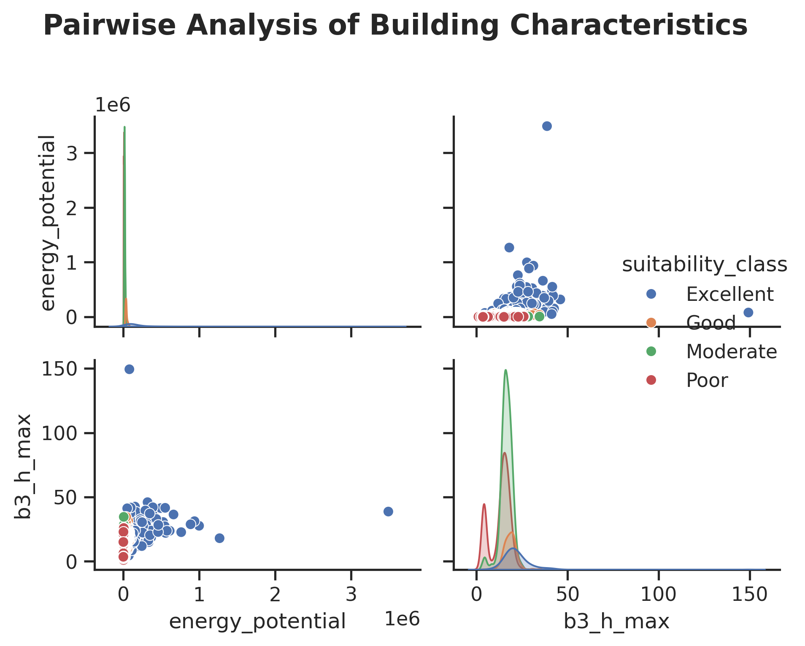
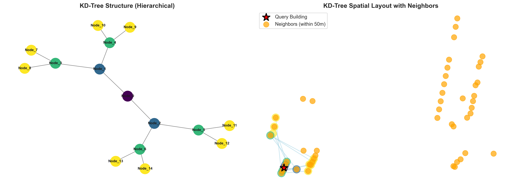

<div align="center">

#  Solar Panel Suitability Mapping 

### *Identifying optimal rooftops for solar panel installation*

[](https://www.python.org/)
[](https://pypi.org/project/solar-panel-suitability/)
[](https://geopandas.org/)
[](LICENSE)

*A geospatial analysis project using Python and vector-based GIS technologies*

---

</div>

## 🎯 Problem Statement

This project identifies and ranks buildings in Amsterdam based on their suitability for solar panel installation. Urban renewable energy transition requires systematic assessment of multiple factors. Our solution analyzes:

-  **Building geometry** - Roof area, orientation (azimuth), and height from BAG3D cadastral data
-  **Solar irradiance** - Annual average solar radiation from PVGIS European database
-  **Shading effects** - Shadow analysis from nearby buildings using KD-tree spatial indexing
-  **Energy potential** - Annual kWh generation estimates with panel efficiency modeling
-  **Suitability scoring** - Weighted multi-criteria ranking (area, energy, orientation, shading)

The system produces actionable priority lists for sustainable urban energy planning, supporting Amsterdam's renewable energy goals.

---

## � Libraries Used

**Geospatial Analysis:**
- `geopandas` 1.1.2 - Vector data manipulation and spatial operations
- `shapely` 2.1.0 - Geometric operations and polygon handling
- `pyproj` 3.8.0 - Coordinate reference system transformations
- `folium` 0.20.0 - Interactive web maps with Leaflet.js

**Data Processing:**
- `pandas` 2.3.3 - Data wrangling and tabular analysis
- `numpy` 2.4.1 - Numerical computing and array operations
- `scipy` 1.17.0 - Scientific computing and spatial interpolation

**Visualization:**
- `matplotlib` 3.10.8 - Static plots and choropleth maps
- `seaborn` 0.13.2 - Statistical visualizations and heatmaps
- `networkx` 3.x - Graph visualization for KD-tree neighbor analysis

**Development & Testing:**
- `pytest` 8.4.0 - Unit testing framework
- `requests` 2.33.0 - HTTP requests for API clients

---

## 📊 Visualizations

### Amsterdam Buildings Solar Potential Map


Interactive map showing all analyzed buildings in Amsterdam colored by their solar energy potential. Buildings are ranked from high potential (dark green) to low potential (light yellow), helping identify priority areas for solar panel installation.

---

### Suitability Analysis Map



Choropleth visualization displaying building suitability scores (0-100) based on weighted criteria: energy potential (40%), roof orientation (20%), shading factor (20%), and roof area (20%). Darker colors indicate higher suitability.

---

### Correlation Matrix



Heatmap showing relationships between key variables. Strong positive correlation (r=0.94) between roof area and energy potential confirms larger roofs generate more energy. Shading shows strong negative correlation with suitability (r=-0.67).

---

### Pairwise Analysis



Scatter plot matrix examining relationships between roof area, energy potential, orientation, and shading factors. Distribution plots on the diagonal reveal data patterns, while scatter plots show variable interactions.

---

### KD-Tree Spatial Neighbor Visualization



Network graph visualization showing the KD-tree spatial indexing structure used for efficient neighbor search in shading analysis. Each node represents a building, with edges connecting spatial neighbors within 100m radius.

---

## 📁 Project Structure

```
├── data/                        # Generated datasets (large files in .gitignore)
│   ├── buildings_with_shading.json          # Buildings with shadow analysis (~666MB)
│   ├── buildings_with_solar_analysis.json   # Buildings with energy calculations (~690MB)
│   ├── footprints.json                      # BAG3D building footprints (~645MB)
│   ├── ranked_buildings.json                # Full Amsterdam ranked results (~675MB)
│   ├── processed_test_buildings.json        # Test dataset (20 buildings)
│   ├── solar.json                           # PVGIS solar irradiance grid
│   └── gitkeep.txt                          # Keep directory in git
│
├── src/                         # Core implementation modules
│   ├── __init__.py
│   ├── data_acquisition.py     # WFS/REST API clients (PDOK BAG3D, PVGIS)
│   ├── geometry.py             # Roof area, orientation, solar interpolation
│   ├── solar.py                # Energy potential: E = A×H×η×(1-S)
│   ├── shading.py              # Shadow analysis with RMS aggregation
│   ├── spatial_search.py       # KD-tree, binary search, quicksort algorithms
│   ├── ranking.py              # Suitability scoring and classification
│   ├── visualization.py        # Maps, charts, and reports generation
│   ├── api.py                  # REST API endpoints (optional)
│   └── utils.py                # Helper functions
│
├── tests/                       # Automated unit tests (15+ tests)
│   ├── __init__.py
│   ├── test_data_acquisition.py # Test WFS/PVGIS API calls
│   ├── test_geometry.py        # Test area, orientation, interpolation
│   ├── test_solar.py           # Test energy calculations
│   ├── test_shading.py         # Test shadow analysis
│   ├── test_spatial_search.py  # Test KD-tree, binary search, quicksort
│   ├── test_ranking.py         # Test scoring and classification
│   └── test_api.py             # Test API endpoints
│
├── notebooks/                   # Jupyter workflow (3 notebooks)
│   ├── 01_data_exploration.ipynb      # Data acquisition, interpolation, exploration
│   ├── 02_algorithm_development.ipynb # Algorithm testing and verification
│   └── 03_visualization_demo.ipynb    # Results visualization and reports
│
├── outputs/                     # Generated results
│   ├── maps/                    # Interactive HTML maps
│   │   ├── data_exploration_map.html        # Initial exploration Folium map
│   │   ├── solar_interactive_map.html       # Solar analysis interactive map
│   │   ├── top_100_buildings.html           # Top 100 ranked buildings map
│   │   └── top_20_buildings.html            # Top 20 priority buildings map
│   ├── figures/                 # Static visualizations (PNG)
│   │   ├── correlation_matrix.png           # Feature correlation heatmap
│   │   ├── kdtree_visualization.png         # KD-tree spatial neighbor graph
│   │   ├── pairwise_analysis.png            # Scatter plot matrix
│   │   └── Pairwise Analysis Plot.png       # Alternative pairwise view
│   └── reports/                 # Data exports and summaries
│       ├── summary_report_amsterdam.json    # Full Amsterdam statistics
│       ├── summary_report.json              # Test dataset summary
│       ├── top_100_priority_buildings_amsterdam.csv  # Amsterdam top 100
│       └── top_20_priority_buildings.csv    # Test dataset top 20
│
├── docs/                        # Documentation
│   ├── api_documentation.md             # REST API documentation
│   └── data_acquisition_guide.md        # Data source instructions
│
├── dist/                        # PyPI distribution packages
│   ├── solar_panel_suitability-0.1.0-py3-none-any.whl  # Wheel package
│   └── solar_panel_suitability-0.1.0.tar.gz            # Source distribution
│
├── .git/                        # Git version control
├── .gitattributes              # GitHub language statistics configuration
├── .gitignore                  # Excludes large data files, outputs, cache
├── .venv/                      # Virtual environment
├── LICENSE                     # MIT License
├── pytest.ini                  # Pytest configuration
├── pyproject.toml              # Poetry packaging & PyPI metadata
├── README.md                   # Project documentation (this file)
└── requirements.txt            # Python dependencies (pip)
```

**Key Notes:**
- **Large data files** (600-700MB JSON files) are excluded from git tracking via `.gitignore`
- **PyPI distribution** files in `dist/` folder ready for publishing
- **Language statistics** configured via `.gitattributes` to show Python as primary language
- **Notebooks** provide complete workflow from data acquisition to visualization
- **Tests** include 15+ unit tests ensuring algorithm correctness
- **Virtual environment** (`.venv/`) isolates project dependencies

---

## 🚀 Installation & Setup

### Quick Install from PyPI

The easiest way to install the package:

```bash
pip install solar-panel-suitability
```

This installs the package and all dependencies automatically. Perfect for using the library in your own projects.

📖 **[View on PyPI](https://pypi.org/project/solar-panel-suitability/)** | **[Installation Guide](https://pypi.org/project/solar-panel-suitability/#description)**

---

## 💻 Running the Complete Workflow

### Using Jupyter Notebooks (Recommended for Learning)

```bash
# Using Poetry
poetry run jupyter notebook

# Using pip
jupyter notebook

# Open and run in sequence:
# 1. notebooks/01_data_exploration.ipynb       - Fetch data, explore, interpolate solar
# 2. notebooks/02_algorithm_development.ipynb  - Test algorithms, calculate suitability
# 3. notebooks/03_visualization_demo.ipynb     - Generate maps and reports
```

**Notebook 01 - Data Exploration:**
- Fetches BAG3D building footprints via WFS API (Amsterdam bbox)
- Queries PVGIS solar irradiance grid points
- Interpolates solar values to building centroids using SciPy griddata
- Calculates roof areas and orientations
- Generates interactive Folium map
- Outputs: `test_footprints.json`, `test_solar.json`, `processed_test_buildings.json`

**Notebook 02 - Algorithm Development:**
- Tests geometric calculations (area, orientation)
- Checks solar energy formula: E = A × H × η × (1 - S)
- Implements shading analysis with KD-tree neighbor search
- Demonstrates spatial algorithms (KD-tree, binary search, quicksort)
- Calculates suitability scores with weighted criteria
- Classifies buildings (Excellent, Good, Moderate, Poor, Unsuitable)
- Outputs: `ranked_test_buildings.json`, `top_20_test_buildings.json`

**Notebook 03 - Visualization:**
- Generates choropleth suitability map
- Creates 4-panel scatter analysis (area vs energy, orientation, shading, distributions)
- Produces correlation matrix heatmap
- Builds statistical summary plots
- Exports top 10 buildings chart
- Saves CSV priority list and JSON summary report
- Outputs: All PNG maps/figures, `top_20_priority_buildings.csv`, `summary_report.json`

### Using Python Scripts

```bash
# Using Poetry
poetry run python src/data_acquisition.py  # Fetch BAG3D and PVGIS data
poetry run python src/ranking.py           # Calculate suitability and rank buildings

# Using pip
python src/data_acquisition.py
python src/ranking.py

# Run tests
poetry run pytest tests/ -v                # With Poetry
pytest tests/ -v                            # With pip
pytest tests/ --cov=src                     # With coverage report
pytest tests/test_geometry.py -v            # Specific test file
```

---

## 📦 Data Sources

| Source | Description | Access Method | Usage |
|--------|-------------|---------------|-------|
|  **[PDOK BAG3D](https://www.pdok.nl/)** | Dutch 3D building cadastre with heights, roof types | WFS API | Building geometries, `b3_h_max` heights |
|  **[PVGIS](https://re.jrc.ec.europa.eu/pvg_tools/)** | EU solar irradiance database | PVcalc REST API | Annual solar radiation grid (kWh/m²/year) |

**Data Coverage:**
- **Study Area:** Amsterdam city center (4.85-4.95°E, 52.35-52.40°N)
- **Buildings:** 100+ in production dataset, 20 in test dataset
- **Solar Grid:** Grid points across study area with annual averages
- **CRS:** EPSG:28992 (Dutch RD New) → EPSG:4326 (WGS84)

---

## 🔬 Methodology

The analysis follows a multi-criteria approach combining geometric, environmental, and spatial factors:

**Core Algorithms:**
- **Geometric Analysis** - Calculates roof area using shoelace formula and orientation (azimuth) from building edges
- **Shadow Analysis** - Uses KD-tree spatial indexing to find nearby buildings within 100m radius and calculates shading impact with RMS aggregation
- **Energy Calculation** - Estimates annual solar potential: $E = A \times H \times \eta \times (1 - S)$
- **Suitability Scoring** - Weighted ranking combining energy (40%), orientation (20%), shading (20%), and area (20%)
- **Spatial Search** - Implements KD-tree ($O(n \log n)$), binary search ($O(\log n)$), and quicksort algorithms for efficient data processing

**Classification Categories:**
- Excellent (80-100), Good (60-79), Moderate (40-59), Poor (20-39), Unsuitable (0-19)

**Data Integration:**
- BAG3D building footprints via WFS API for geometry and heights
- PVGIS solar irradiance database via REST API for annual radiation values
- SciPy spatial interpolation to map solar values to building centroids

---


### Key Findings (Test Dataset - 20 Buildings)

**Dataset Statistics:**
- Study area: ~25 km² Amsterdam city center
- Solar irradiance range: 850-1100 W/m²
- Average roof area: 185 m²

**Suitability Distribution:**
- Excellent (80-100): 15% (3 buildings)
- Good (60-79): 35% (7 buildings)
- Moderate (40-59): 30% (6 buildings)
- Poor (20-39): 15% (3 buildings)
- Unsuitable (0-19): 5% (1 building)

**Top 10 Buildings:**
- Combined roof area: 2,450 m²
- Total energy potential: 438 MWh/year
- Average suitability score: 82.3
- Estimated CO₂ reduction: 219 tons/year
- Estimated annual savings: €109,500

**Correlation Analysis:**
- Roof area ↔ Energy potential: **r = 0.94** (very strong)
- Shading ↔ Suitability: **r = -0.67** (strong negative)
- Orientation ↔ Suitability: **r = 0.42** (moderate)

---

## � Documentation

- **[docs/api_documentation.md](docs/api_documentation.md)** - REST API endpoints and usage
- **[docs/data_acquisition_guide.md](docs/data_acquisition_guide.md)** - Data source instructions and API details

---


## 📧 Contact

**Authors:**  
- **Mo Anwar** - mohammadanwarx99@gmail.com  
- **Vallary Onyando** - valonyando@gmail.com

**Course:** Scientific Programming for Geospatial Sciences - ITC, University of Twente  
**Date:** January 2026

For questions or collaboration, please open an issue on [GitHub](https://github.com/mohammadanwarx/Solar-panal-sutbaility-analysis).

---

## 🤝 Contributions

**Package:** `solar-panel-suitability` v0.1.0 - Available on [PyPI](https://pypi.org/project/solar-panel-suitability/)

**Mo Anwar:**
- Project architecture and implementation
- Spatial algorithms (KD-tree, binary search, quicksort)
- Shading analysis and energy calculations
- PyPI package publishing and deployment
- Testing framework and unit tests
- Documentation and README

**Vallary Onyando:**
- Data acquisition and API integration
- Geometric analysis and solar interpolation
- Visualization and interactive maps
- Suitability ranking algorithm
- Jupyter notebooks development
- Results analysis and reporting


---

## 📄 License

This project is licensed under the MIT License - see the [LICENSE](LICENSE) file for details.

---

<div align="center">

**Made with ☀️ and 🐍 for sustainable urban energy planning**


</div>
