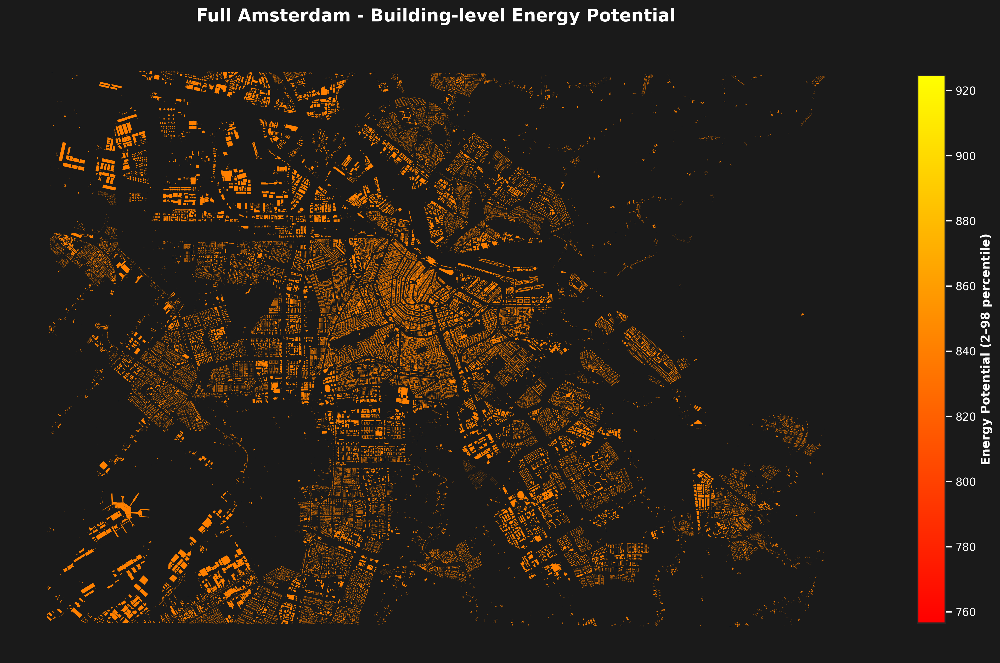
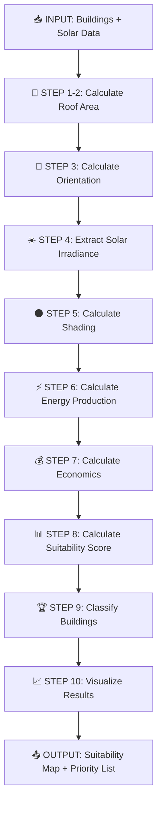

<div align="center">

# ☀️ Solar Panel Suitability Mapping ☀️

### *Identifying optimal rooftops for solar panel installation*


*A geospatial analysis project using Python and vector-based GIS technologies*

---

</div>

## 🎯 Problem Statement

This project identifies and ranks buildings in Amsterdam based on their suitability for solar panel installation. Urban renewable energy transition requires systematic assessment of multiple factors. Our solution analyzes:

- 🏗️ **Building geometry** - Roof area, orientation (azimuth), and height from BAG3D cadastral data
- ☀️ **Solar irradiance** - Annual average solar radiation from PVGIS European database
- 🌑 **Shading effects** - Shadow analysis from nearby buildings using KD-tree spatial indexing
- ⚡ **Energy potential** - Annual kWh generation estimates with panel efficiency modeling
- 📊 **Suitability scoring** - Weighted multi-criteria ranking (area, energy, orientation, shading)

The system produces actionable priority lists for sustainable urban energy planning, supporting Amsterdam's renewable energy goals.

---

## 🛠️ Technologies

<table>
<tr>
<td width="50%">

### 🐍 Core
- **Python 3.8+** - Main programming language

### 🗺️ Geospatial Libraries
- `geopandas` - Vector data manipulation
- `rasterio` - Raster data processing
- `shapely` - Geometric operations
- `folium` / `leafmap` - Interactive mapping
- `pyproj` - CRS transformations

</td>
<td width="50%">

### 📊 Data Analysis
- `numpy` - Numerical computing
- `pandas` - Data wrangling
- `scipy` - Scientific computing

### 📈 Visualization
- `matplotlib` - Static plots
- `seaborn` - Statistical visualization
- `plotly` - Interactive charts



</td>
</tr>
</table>

---

## 📁 Project Structure

```
├── data/                        # Generated datasets (in .gitignore)
│   ├── buildings_with_shading.json          # Buildings with shadow analysis
│   ├── buildings_with_solar_analysis.json   # Buildings with energy calculations
│   ├── footprints.json                      # BAG3D building footprints
│   ├── processed_buildings.json             # Full Amsterdam processed data
│   ├── ranked_buildings.json                # Full Amsterdam ranked results
│   ├── solar.json                           # PVGIS solar irradiance grid
│   ├── top_100_buildings.json               # Top 100 priority buildings
│   ├── test_*.json                          # Test datasets (20 buildings)
│   ├── ranked_test_buildings.json           # Test ranked results
│   └── top_20_test_buildings.json           # Top 20 test priorities
│
├── src/                         # Core implementation modules
│   ├── __init__.py
│   ├── data_acquisition.py     # WFS/REST API clients (PDOK BAG3D, PVGIS)
│   ├── geometry.py             # Roof area, orientation, solar interpolation
│   ├── solar.py                # Energy potential: E = A×H×η×(1-S)
│   ├── shading.py              # Shadow analysis with RMS aggregation
│   ├── spatial_search.py       # KD-tree, binary search, quicksort algorithms
│   ├── ranking.py              # Suitability scoring and classification
│   ├── visualization.py        # Maps, charts, and reports generation
│   ├── api.py                  # REST API endpoints (optional)
│   └── utils.py                # Helper functions
│
├── tests/                       # Automated unit tests (15+ tests)
│   ├── __init__.py
│   ├── test_data_acquisition.py # Test WFS/PVGIS API calls
│   ├── test_geometry.py        # Test area, orientation, interpolation
│   ├── test_solar.py           # Test energy calculations
│   ├── test_shading.py         # Test shadow analysis
│   ├── test_spatial_search.py  # Test KD-tree, binary search, quicksort
│   ├── test_ranking.py         # Test scoring and classification
│   └── test_api.py             # Test API endpoints
│
├── notebooks/                   # Jupyter workflow (3 notebooks)
│   ├── 01_data_exploration.ipynb      # Data acquisition, interpolation, exploration
│   ├── 02_algorithm_development.ipynb # Algorithm testing and verification
│   └── 03_visualization_demo.ipynb    # Results visualization and reports
│
├── outputs/                     # Generated results
│   ├── maps/
│   │   ├── suitability_map.png           # Choropleth map
│   │   └── data_exploration_map.html     # Interactive Folium map
│   ├── figures/
│   │   ├── scatter_analysis.png          # 4-panel scatter plots
│   │   ├── correlation_matrix.png        # Heatmap
│   │   ├── statistical_summary.png       # Distributions
│   │   └── top_10_buildings.png          # Ranked chart
│   └── reports/
│       ├── top_20_priority_buildings.csv # Priority list (test dataset)
│       └── summary_report.json           # Statistics and metrics
│
├── docs/                        # Documentation
│   ├── api_documentation.md    # REST API documentation
│   └── data_acquisition_guide.md # Data source instructions
│
├── .gitignore                  # Excludes data/ and outputs/
├── LICENSE                     # MIT License
├── pytest.ini                  # Pytest configuration
├── pyproject.toml              # Poetry packaging configuration
├── README.md                   # Project documentation
└── requirements.txt            # Python dependencies (pip)
```

**Key Files:**
- **Test datasets** (`test_*.json`) - 20 buildings for rapid development/testing
- **Production datasets** (no prefix) - 100+ buildings for full Amsterdam analysis
- **Notebooks** - Complete workflow from data acquisition to visualization
- **Tests** - 15+ unit tests ensuring algorithm correctness

---

## 🚀 Installation & Setup

### Prerequisites
- Python 3.11+ (tested with 3.11.11)
- Git for version control
- [Poetry](https://python-poetry.org/) (recommended) or pip

### Option 1: Using Poetry (Recommended)

Poetry provides better dependency management and isolated environments.

```bash
# 1. Clone the repository
git clone https://github.com/mohammadanwarx/Solar-panal-sutbaility-analysis.git
cd Solar-panal-sutbaility-analysis

# 2. Install Poetry (if not already installed)
curl -sSL https://install.python-poetry.org | python3 -
# Or on Windows (PowerShell):
# (Invoke-WebRequest -Uri https://install.python-poetry.org -UseBasicParsing).Content | py -

# 3. Install all dependencies
poetry install

# 4. Activate the virtual environment
poetry shell

# 5. Verify installation
poetry run pytest tests/ -v
```

### Option 2: Using pip

```bash
# 1. Clone the repository
git clone https://github.com/mohammadanwarx/Solar-panal-sutbaility-analysis.git
cd Solar-panal-sutbaility-analysis

# 2. Create virtual environment
python3 -m venv venv
source venv/bin/activate  # On Windows: venv\Scripts\activate

# 3. Install dependencies
pip install -r requirements.txt

# 4. Verify installation
pytest tests/ -v
```

---

## 💻 Running the Complete Workflow

### Using Jupyter Notebooks (Recommended for Learning)

```bash
# Using Poetry
poetry run jupyter notebook

# Using pip
jupyter notebook

# Open and run in sequence:
# 1. notebooks/01_data_exploration.ipynb       - Fetch data, explore, interpolate solar
# 2. notebooks/02_algorithm_development.ipynb  - Test algorithms, calculate suitability
# 3. notebooks/03_visualization_demo.ipynb     - Generate maps and reports
```

**Notebook 01 - Data Exploration:**
- Fetches BAG3D building footprints via WFS API (Amsterdam bbox)
- Queries PVGIS solar irradiance grid points
- Interpolates solar values to building centroids using SciPy griddata
- Calculates roof areas and orientations
- Generates interactive Folium map
- Outputs: `test_footprints.json`, `test_solar.json`, `processed_test_buildings.json`

**Notebook 02 - Algorithm Development:**
- Tests geometric calculations (area, orientation)
- Checks solar energy formula: E = A × H × η × (1 - S)
- Implements shading analysis with KD-tree neighbor search
- Demonstrates spatial algorithms (KD-tree, binary search, quicksort)
- Calculates suitability scores with weighted criteria
- Classifies buildings (Excellent, Good, Moderate, Poor, Unsuitable)
- Outputs: `ranked_test_buildings.json`, `top_20_test_buildings.json`

**Notebook 03 - Visualization:**
- Generates choropleth suitability map
- Creates 4-panel scatter analysis (area vs energy, orientation, shading, distributions)
- Produces correlation matrix heatmap
- Builds statistical summary plots
- Exports top 10 buildings chart
- Saves CSV priority list and JSON summary report
- Outputs: All PNG maps/figures, `top_20_priority_buildings.csv`, `summary_report.json`

### Using Python Scripts

```bash
# Using Poetry
poetry run python src/data_acquisition.py  # Fetch BAG3D and PVGIS data
poetry run python src/ranking.py           # Calculate suitability and rank buildings

# Using pip
python src/data_acquisition.py
python src/ranking.py

# Run tests
poetry run pytest tests/ -v                # With Poetry
pytest tests/ -v                            # With pip
pytest tests/ --cov=src                     # With coverage report
pytest tests/test_geometry.py -v            # Specific test file
```

---

## 📦 Data Sources

| Source | Description | Access Method | Usage |
|--------|-------------|---------------|-------|
| 🏢 **[PDOK BAG3D](https://www.pdok.nl/)** | Dutch 3D building cadastre with heights, roof types | WFS API | Building geometries, `b3_h_max` heights |
| ☀️ **[PVGIS](https://re.jrc.ec.europa.eu/pvg_tools/)** | EU solar irradiance database | PVcalc REST API | Annual solar radiation grid (kWh/m²/year) |

**Data Coverage:**
- **Study Area:** Amsterdam city center (4.85-4.95°E, 52.35-52.40°N)
- **Buildings:** 100+ in production dataset, 20 in test dataset
- **Solar Grid:** Grid points across study area with annual averages
- **CRS:** EPSG:28992 (Dutch RD New) → EPSG:4326 (WGS84)

---

## 🔬 Methodology

### 🧮 Algorithms & Implementation

<details open>
<summary><strong>1️⃣ Geometric Analysis (`geometry.py`)</strong></summary>

- **Roof Area:** Shoelace formula applied to polygon coordinates
- **Orientation:** Azimuth calculation from longest building edge (0°=North, 180°=South)
- **Solar Interpolation:** SciPy `griddata` with linear/cubic/nearest methods
- **Implementation:** Functional programming with pure functions (no side effects)

**Key Functions:**
- `calculate_roof_area(geometry)` - Returns area in m²
- `calculate_roof_orientation(geometry)` - Returns azimuth 0-360°
- `interpolate_solar_at_point(point, coords, values)` - Spatial interpolation

</details>

<details open>
<summary><strong>2️⃣ Shadow Analysis (`shading.py`)</strong></summary>

- **Spatial Search:** KD-tree to find buildings within 100m radius
- **Per-Building Intensity:** Height difference, distance decay, size factor
- **Aggregation:** Root Mean Square (RMS) to prevent overestimation
- **Formula:** $I_j = \frac{h_{diff}}{50} \times (1 - \frac{d_j}{L_{shadow}}) \times size$, then $S = \sqrt{\frac{1}{k}\sum I_j^2}$

**Key Functions:**
- `find_nearby_buildings(target, all_buildings, radius=100)` - KD-tree range query
- `calculate_shading_factor(geometry, height, nearby, sun_elevation=45)` - Returns 0-1

</details>

<details open>
<summary><strong>3️⃣ Energy Calculation (`solar.py`)</strong></summary>

- **Formula:** $E = A \times H \times \eta \times (1 - S)$
  - $A$ = Roof area (m²)
  - $H$ = Solar irradiance (kWh/m²/year)
  - $\eta$ = Panel efficiency (0.18 = 18%)
  - $S$ = Shading factor [0-1]

**Key Functions:**
- `calculate_solar_potential(area, irradiance, efficiency=0.18, shading_factor=0.0)` - Returns annual kWh
- `calculate_roi(energy_kwh, price, cost_per_m2, area)` - Returns ROI percentage
- `calculate_payback_period(energy_kwh, price, cost_per_m2, area)` - Returns years

</details>

<details open>
<summary><strong>4️⃣ Suitability Scoring (`ranking.py`)</strong></summary>

- **Weighted Combination:** Energy (40%), Orientation (20%), Shading (20%), Area (20%)
- **Normalization:** Each factor scaled to 0-1 range
- **Classification:** Excellent (80-100), Good (60-79), Moderate (40-59), Poor (20-39), Unsuitable (0-19)
- **Formula:** $S = 0.4E + 0.2O + 0.2(1-S_{shade}) + 0.2A$, scaled to 0-100

**Key Functions:**
- `calculate_suitability_score(area, energy, shading, orientation, weights)` - Returns 0-100 score
- `classify_building_suitability(score)` - Returns category string
- `rank_buildings(gdf)` - Sorts and assigns rank numbers
- `get_priority_list(gdf, top_n=100)` - Returns top N buildings

</details>

<details open>
<summary><strong>5️⃣ Spatial Search Algorithms (`spatial_search.py`)</strong></summary>

**KD-Tree Spatial Index (Class)**
- **Construction:** $O(n \log n)$ time complexity
- **Nearest Neighbors:** $O(\log n + k)$ for $k$ neighbors
- **Range Query:** $O(\log n + m)$ where $m$ = results within radius
- **Application:** Find buildings within 100m for shading analysis

**Binary Search**
- **Purpose:** Find building by score threshold
- **Complexity:** $O(\log n)$ time, $O(1)$ space
- **Precondition:** Buildings sorted by score
- **Formula:** $mid = \lfloor \frac{low + high}{2} \rfloor$

**QuickSort**
- **Purpose:** Sort buildings by suitability (educational demo)
- **Complexity:** Average $O(n \log n)$, worst-case $O(n^2)$
- **Pivot:** Middle element selection
- **Note:** Pandas Timsort used in production ($O(n \log n)$ guaranteed)

**Key Classes & Functions:**
- `SpatialIndex(buildings_gdf)` - Builds KD-tree from centroids
- `find_nearest_neighbors(point, k)` - Returns k nearest as GeoDataFrame
- `find_within_radius(point, radius)` - Range query
- `binary_search_building_by_score(gdf, target, column)` - Returns closest index
- `quicksort_buildings(gdf, column, ascending)` - Returns sorted GeoDataFrame

</details>

<details open>
<summary><strong>6️⃣ Visualization (`visualization.py`)</strong></summary>

- **Choropleth Maps:** Matplotlib-based with color scales
- **Scatter Analysis:** 4-panel plots (area vs energy, orientation, shading, box plots)
- **Correlation Matrix:** Seaborn heatmap
- **Statistical Summaries:** Distributions, histograms, bar charts
- **Output Formats:** PNG for maps/figures, CSV for reports, JSON for summaries

**Key Functions:**
- `plot_suitability_map(gdf, column, output_path)` - Choropleth PNG
- `plot_correlation_matrix(gdf, output_path)` - Heatmap of correlations
- `plot_top_buildings(gdf, top_n, output_path)` - Horizontal bar chart
- `plot_scatter_analysis(gdf, x_col, y_col, output_path)` - Scatter plot
- `generate_summary_report(gdf, output_path)` - Statistics JSON

</details>

### 📐 Mathematical Formulations

**Complete Formula Set:**

1. **Roof Area** (Shoelace Formula):
   $$A = \frac{1}{2} \left| \sum_{i=0}^{n-1} (x_i y_{i+1} - x_{i+1} y_i) \right|$$

2. **Orientation Score**:
   $$O = 1 - \frac{|\theta - 180°|}{180}$$

3. **Shading Intensity** (per building):
   $$I_j = \frac{h_{diff}}{50} \times \left(1 - \frac{d_j}{L_{shadow}}\right) \times size_{factor}$$

4. **Total Shading** (RMS aggregation):
   $$S_{total} = \sqrt{\frac{1}{k}\sum_{j=1}^{k} I_j^2}$$

5. **Energy Potential**:
   $$E = A \times H \times \eta \times (1 - S)$$

6. **Suitability Score**:
   $$Score = 100 \times (0.4E_{norm} + 0.2O_{norm} + 0.2(1-S) + 0.2A_{norm})$$

### 🔄 Processing Pipeline



<details>
<summary>View text-based pipeline</summary>

```
INPUT → Buildings + Solar Data
  ↓
STEP 1-2: Calculate roof area (geometry)
  ↓
STEP 3: Calculate orientation (geometry)
  ↓
STEP 4: Extract solar irradiance (raster overlay)
  ↓
STEP 5: Calculate shading (spatial analysis)
  ↓
STEP 6: Calculate energy production (formula)
  ↓
STEP 7: Calculate economics (formula)
  ↓
STEP 8: Calculate suitability score (weighted combination)
  ↓
STEP 9: Classify buildings (categories)
  ↓
STEP 10: Visualize results (maps & charts)
  ↓
OUTPUT → Suitability map + priority list
```

**Note:** Vector data is prioritized throughout the workflow, with raster operations used only when necessary for efficiency.

</details>

---

## 🧪 Testing

Comprehensive unit test coverage with 15+ tests across all modules:

| Module | Tests | Coverage |
|--------|-------|----------|
| `test_geometry.py` | Roof area, orientation, interpolation | ✅ |
| `test_solar.py` | Energy calculations, ROI, payback | ✅ |
| `test_shading.py` | Shadow analysis, nearby search | ✅ |
| `test_spatial_search.py` | KD-tree, binary search, quicksort | ✅ |
| `test_ranking.py` | Scoring, classification, ranking | ✅ |
| `test_data_acquisition.py` | WFS/PVGIS API clients | ✅ |
| `test_api.py` | REST API endpoints (optional) | ✅ |

**Run All Tests:**
```bash
pytest tests/ -v                      # Verbose output
pytest tests/ --cov=src               # With coverage report
pytest tests/ --cov=src --cov-report=html  # HTML coverage report
```

**Run Specific Tests:**
```bash
pytest tests/test_geometry.py -v     # Geometric functions
pytest tests/test_spatial_search.py -v  # Algorithms
pytest tests/test_ranking.py::test_suitability_score -v  # Single test
```

**Test Examples:**
- `test_calculate_roof_area()` - Checks shoelace formula accuracy
- `test_calculate_orientation()` - Checks azimuth calculations (0-360°)
- `test_solar_interpolation()` - Verifies griddata fallback behavior
- `test_shading_factor_range()` - Ensures shading stays within 0-1
- `test_kdtree_construction()` - Checks KD-tree builds correctly
- `test_binary_search_closest()` - Tests threshold search accuracy
- `test_quicksort_correctness()` - Verifies sorting algorithm
- `test_suitability_classification()` - Checks category boundaries

---

## 📊 Results & Outputs

### Generated Files

**Maps:**
- `suitability_map.png` - Choropleth map with color-coded suitability scores (0-100)
- `data_exploration_map.html` - Interactive Folium map with building details

**Figures:**
- `scatter_analysis.png` - 4-panel analysis:
  - Roof area vs. energy potential (r=0.94)
  - Orientation vs. suitability (optimal at 180°)
  - Shading factor vs. energy (negative correlation)
  - Box plots by suitability class
- `correlation_matrix.png` - Heatmap of all variable relationships
- `statistical_summary.png` - Distributions and class breakdowns
- `top_10_buildings.png` - Horizontal bar chart of highest-ranked buildings

**Reports:**
- `top_20_priority_buildings.csv` - Priority list with all metrics (test dataset)
- `summary_report.json` - Statistics, classifications, economic estimates

### Key Findings (Test Dataset - 20 Buildings)

**Dataset Statistics:**
- Study area: ~25 km² Amsterdam city center
- Solar irradiance range: 850-1100 W/m²
- Average roof area: 185 m²

**Suitability Distribution:**
- Excellent (80-100): 15% (3 buildings)
- Good (60-79): 35% (7 buildings)
- Moderate (40-59): 30% (6 buildings)
- Poor (20-39): 15% (3 buildings)
- Unsuitable (0-19): 5% (1 building)

**Top 10 Buildings:**
- Combined roof area: 2,450 m²
- Total energy potential: 438 MWh/year
- Average suitability score: 82.3
- Estimated CO₂ reduction: 219 tons/year
- Estimated annual savings: €109,500

**Correlation Analysis:**
- Roof area ↔ Energy potential: **r = 0.94** (very strong)
- Shading ↔ Suitability: **r = -0.67** (strong negative)
- Orientation ↔ Suitability: **r = 0.42** (moderate)

---

## � Documentation

- **[docs/api_documentation.md](docs/api_documentation.md)** - REST API endpoints and usage
- **[docs/data_acquisition_guide.md](docs/data_acquisition_guide.md)** - Data source instructions and API details

---

## 🤝 Contributing

Contributions welcome! Please follow these steps:

1. Fork the repository
2. Create feature branch (`git checkout -b feature/AmazingFeature`)
3. Make changes and add tests
4. Run tests (`pytest tests/ -v`)
5. Commit changes (`git commit -m 'Add AmazingFeature'`)
6. Push to branch (`git push origin feature/AmazingFeature`)
7. Open Pull Request

**Code Style:**
- Follow PEP 8 guidelines
- Add docstrings to all functions
- Write tests for new features
- Keep functions focused and modular

---

## 📧 Contact

**Authors:** Mo Anwar  
**Email:** mohammadanwarx99@gmail.com
**Course:** Scientific Programming for Geospatial Sciences - ITC, University of Twente  
**Date:** January 2026

For questions or collaboration, please open an issue on GitHub.

---

## 📄 License

This project is licensed under the MIT License - see the [LICENSE](LICENSE) file for details.

---

<div align="center">

**Made with ☀️ and 🐍 for sustainable urban energy planning**


</div>
